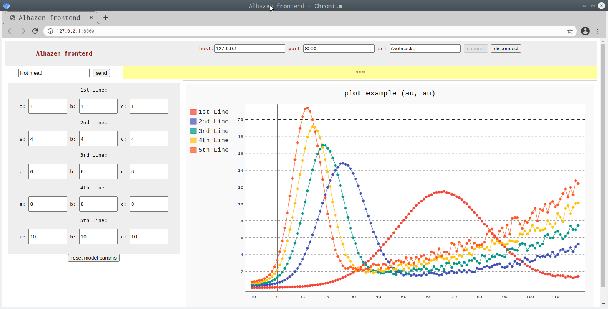

# alhazen

(see: [https://en.wikipedia.org/wiki/Ibn_al-Haytham] to know where the name of the project is from)

TAGS: tornado asyncio websocket 

1. create a virtualenv 
>     $ export VIRTENV_ROOT=desired-virtenv_root-path
>     $ mkdir ${VIRTENV_ROOT}
>     $ virtualenv -p /usr/bin/python3 ${VIRTENV_ROOT}

2. clone this project in ${PROJECT_ROOT}
>     $ git clone git@github.com:giovanni-angeli/alhazen.git

3. build Install in edit mode:
>     $ . ${VIRTENV_ROOT}/bin/activate
>     $ cd ${PROJECT_ROOT}               
>     $ pip install -e ./

4. Run:
>     $ . ${VIRTENV_ROOT}/bin/activate ; alhazen

#

